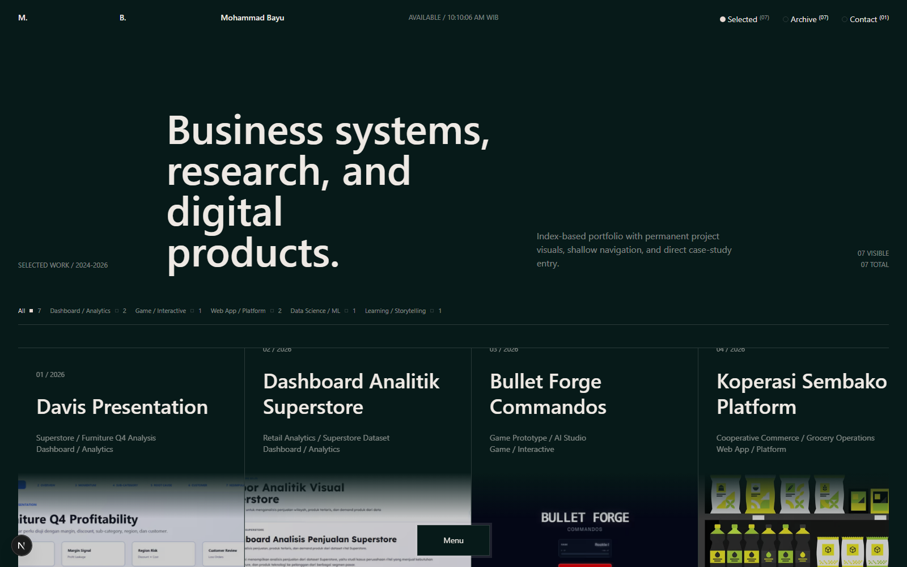

# 🎨 Mohammad Bayu Portfolio

Portfolio website pribadi yang dibangun dengan Next.js, React, dan Tailwind CSS. Menampilkan project-project dan case studies dengan animasi interaktif menggunakan GSAP dan Lenis.



## 🚀 Tech Stack

- **Framework**: Next.js 16.2.6
- **UI Library**: React 19.2.6
- **Styling**: Tailwind CSS 4.3.0
- **Animations**: GSAP 3.15.0
- **Smooth Scroll**: Lenis 1.3.23
- **Language**: TypeScript 5.9.3

## ✨ Features

- 🎯 Interactive project showcase dengan hover preview
- 🎨 Custom sketch cursor animation
- 📱 Fully responsive design
- ⚡ Smooth scrolling dengan Lenis
- 🎭 Advanced animations dengan GSAP
- 🔍 Project filtering system
- 📊 Detailed case studies
- 🎪 Floating navigation menu

## 📁 Project Structure

```
├── app/
│   ├── globals.css          # Global styles
│   ├── layout.tsx           # Root layout
│   ├── page.tsx             # Home page
│   └── projects/[slug]/     # Dynamic project pages
├── components/
│   ├── CaseStudySection.tsx
│   ├── FloatingMenu.tsx
│   ├── FooterNextProject.tsx
│   ├── Header.tsx
│   ├── MotionSystem.tsx
│   ├── ProjectFilter.tsx
│   ├── ProjectHoverPreview.tsx
│   ├── ProjectIndexTable.tsx
│   ├── ProjectMetaTable.tsx
│   ├── ProjectRow.tsx
│   └── SketchCursor.tsx
├── data/
│   └── projects.ts          # Project data
├── lib/
│   └── utils.ts             # Utility functions
└── public/
    └── projects/            # Project images
```

## 🛠️ Installation

### Prerequisites
- Node.js 20 atau lebih tinggi
- npm atau yarn

### Setup

1. Clone repository
```bash
git clone https://github.com/siberbot88/new-portofolio-boy.git
cd new-portofolio-boy
```

2. Install dependencies
```bash
npm install
```

3. Run development server
```bash
npm run dev
```

4. Open browser
```
http://localhost:3000
```

## 📜 Available Scripts

```bash
# Development
npm run dev              # Start dev server

# Production
npm run build           # Build for production
npm start               # Start production server

# Code Quality
npm run lint            # Run ESLint
npm run typecheck       # Run TypeScript type checking

# Styling
npm run styles:build    # Build Tailwind CSS
```

## 🚀 Deployment

Lihat [DEPLOYMENT.md](./DEPLOYMENT.md) untuk panduan lengkap deployment ke:
- ✅ Vercel (Recommended)
- ✅ Netlify
- ✅ VPS/Server Sendiri
- ✅ GitHub Pages

### Quick Deploy ke Vercel

[](https://vercel.com/new/clone?repository-url=https://github.com/siberbot88/new-portofolio-boy)

## 📊 Projects Showcase

Portfolio ini menampilkan berbagai project:

1. **Bullet Forge Commandos** - Game Development
2. **Dashboard Analitik Superstore** - Data Visualization
3. **Davis Presentation** - Interactive Presentation
4. **Early Warning System** - System Development
5. **ETS Storytelling** - Data Storytelling
6. **Koperasi Sembako Platform** - E-commerce Platform
7. **Website Sajak Kopi** - Website Development
8. Dan masih banyak lagi...

## 🎨 Design Features

- **Minimalist Design**: Clean dan modern interface
- **Interactive Elements**: Hover effects dan smooth transitions
- **Custom Cursor**: Sketch-style cursor untuk pengalaman unik
- **Smooth Scrolling**: Lenis untuk scrolling yang halus
- **Responsive Layout**: Optimal di semua device sizes

## 🔧 Configuration

### Tailwind CSS
Configuration di `postcss.config.mjs` dan inline di `app/globals.css`

### Next.js
Configuration di `next.config.ts`

### TypeScript
Configuration di `tsconfig.json`

## 📝 Adding New Projects

Edit `data/projects.ts`:

```typescript
{
  id: 'project-slug',
  title: 'Project Title',
  year: '2024',
  category: 'Category',
  tags: ['tag1', 'tag2'],
  description: 'Project description',
  image: '/projects/project-image.png',
  link: 'https://project-url.com',
  github: 'https://github.com/username/repo',
  featured: true,
  caseStudy: {
    // Case study details
  }
}
```

## 🤝 Contributing

Contributions, issues, dan feature requests sangat diterima!

1. Fork repository
2. Create feature branch (`git checkout -b feature/AmazingFeature`)
3. Commit changes (`git commit -m 'Add some AmazingFeature'`)
4. Push to branch (`git push origin feature/AmazingFeature`)
5. Open Pull Request

## 📄 License

This project is open source dan tersedia untuk digunakan sebagai referensi.

## 👤 Author

**Mohammad Bayu**

- GitHub: [@siberbot88](https://github.com/siberbot88)
- Portfolio: [Coming Soon]

## 🙏 Acknowledgments

- Next.js team untuk framework yang luar biasa
- GSAP untuk animation library
- Tailwind CSS untuk utility-first CSS framework
- Semua open source contributors

---

⭐ Star repository ini jika membantu Anda!

Made with ❤️ and ☕ by Mohammad Bayu
